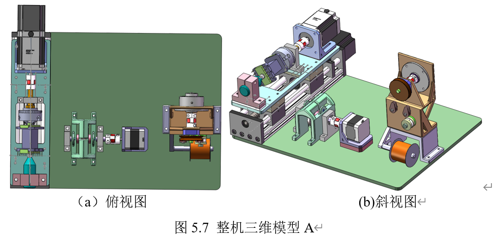
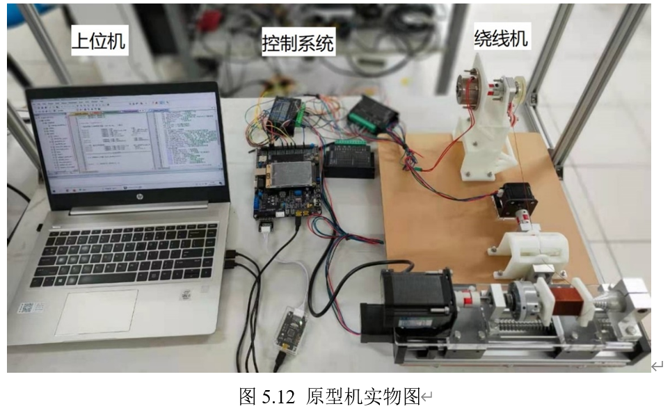
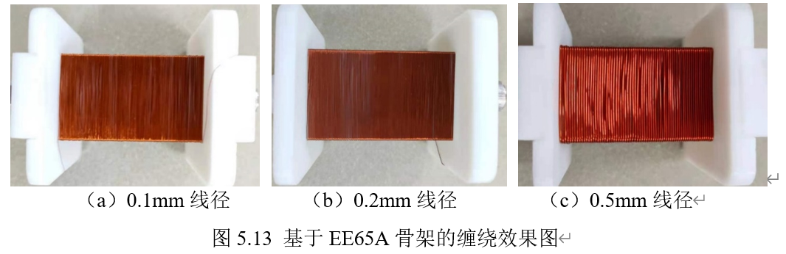

# 电子变压器自动绕线机

## 项目简介

在缠绕矩形线圈时，通过机械结构上的反补法实现恒速度出线。然后在恒速度出线的基础上，通过控制磁粉制动器的电流，实现漆包线的恒张力控制，

## 项目实图

## 项目总结

​		本文为解决缠绕矩形线圈时的张力波动问题开发了一套基于主动速度补偿原理的电子变压器自动绕线机系统。首先利用Auto CAD与MATLAB进行运动学分析，之后利用SolidWorks进行原型机的三维结构设计，最后设计整机的控制系统，包括：利用Keil uVision开发基于STM32的下位机系统，和利用QT开发基于PC的上位机系统，整套系统始终站在可移植、可拓展和可升级的角度进行开发。

本文以电子变压器自动绕线机中的恒张力控制技术为重点展开研究，主要工作内容及成果如下所述：

1. 通过阅读大量文献资料，发现异形线圈的张力控制问题即为目前张力控制技术发展中的重难点，随后给出了基于主动补偿的电子变压器自动绕线机系统实现方案。

2. 针对各种形状线圈的缠绕过程分别构建其运动学模型。由圆形线圈、直角矩形线圈，再到实际的圆角矩形线圈，分别对其缠绕过程中运动导线的长度及其变化速度、加速度建立数学模型，并进行仿真分析。
3. 根据主动补偿实现方案，分别给出了缠绕不同形状线圈时位移补偿量与角度的数学关系。然后分别对缠绕直角矩形、圆角矩形线圈时运动导线的位移补偿量与线圈旋转角度的关系进行仿真，并分析验证。
4. 根据前述得知的关于矩形线圈主动位移补偿量与旋转角度的关系，给出了三种补偿机构实现方案，分别为：主动式摆杆机构、直动平底凸轮机构和接触式凸轮机构。因主动式摆杆机构转角变化较小，控制难度较大，直动平底凸轮机构摩擦现象也较为明显，最后经综合分析，选择接触式凸轮机构作为原型机补偿机构的实现方案。
5. 根据基于主动补偿的系统实现方案设计原型机，包括：设计整机机械机构和搭建控制系统。之后根据动力学原理，给出了圆形、矩形绕线骨架及磁滞制动器的数学模型，其中，磁滞制动器数学模型为一阶惯性加纯滞后的系统。最后对实验装置的动态控制系统实现进行了仿真分析。
6. 实验表明，根据本文研发的电子变压器自动绕线机在EE65A型号的矩形绕线骨架上缠绕0.1mm、0.2mm和0.5mm线径的漆包线均能获得良好的绕制效果。